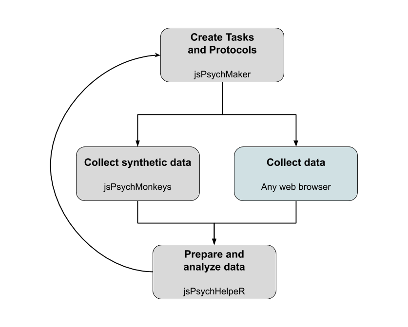

# jsPsychHelpeR

Project template and set of helper scripts for data preparation and analysis of [jsPsych](https://www.jspsych.org/) experiments created with [jsPsych-maker](https://github.com/gorkang/jsPsych-maker).

Please, address any correspondence to [gorkang\@gmail.com](mailto:gorkang@gmail.com){.email}

## Setup

1.  Run `setup.R` :

-   Makes sure all the necessary packages are present\
-   Makes sure all the necessary folders are present

## Data preparation and analysis

We use the {targets} (<https://github.com/wlandau/targets>) package.

**The whole process can be reproduced running `targets::tar_make()`**

A nice visualization of all the pre-processing steps can be seen with `targets::tar_visnetwork(targets_only = TRUE)`

The file `_targets.R` contains the important parameters and calls to all the functions used when running `targets::tar_make()`

To see more detail about any specific step, you can:

1.  Go to the relevant function\
2.  Load the input parameters of the function with `targets::tar_load()`\
3.  Run the code step by step as you would normally do

## Output tables and plots

-   **Raw data** (anonymized) are in `data/raw_data_anonymized.csv`

-   **Plots** and **tables** are in `output/plots` and `output/tables` respectively.

-   **Dataframes** for different stages of data processing can be seen in `output/data`
