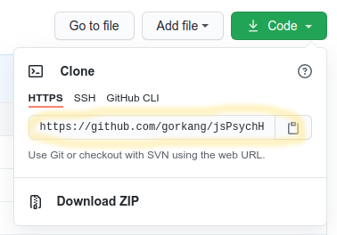
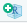
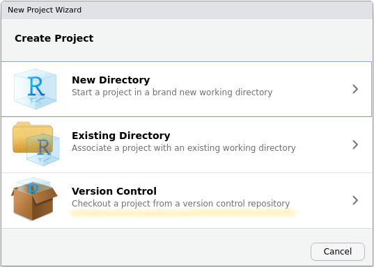
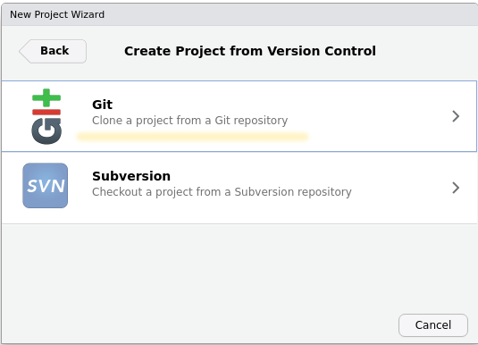
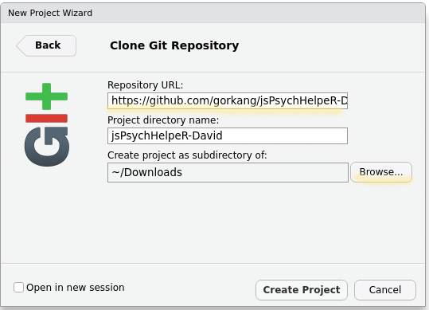
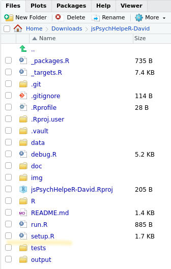
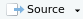
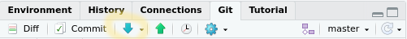
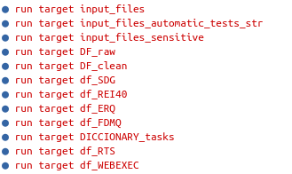

# THIS INSTRUCTIONS ARE OUTDATED! SEE img/ etc

```{r setup, include=FALSE}
knitr::opts_chunk$set(echo = TRUE)
```

---  

Instrucciones para descargar, configurar y correr el script de preparación de datos del proyecto **jsPsychHelpeR**

---  


## Pre-requisitos:

Deberían estar instalados los siguientes programas:  

- RStudio: https://rstudio.com/products/rstudio/download/  
- Git (en linux esta preinstalado): https://git-scm.com/download


## Paso a paso


### Crear y replicar proyecto 

---  


1. Ve a https://github.com/gorkang/jsPsychHelpeR, haz click en  

---  


2. Copia la "URL" que aparece ahí: 

---  

3. Abre RStudio: 


---  

4. Crea un Nuevo proyecto:

- File -> New Project
- 

---  

5. Version control:  


---  

6. Git:  


---  

7. Pega la "URL" que copiamos arriba en `Repository URL`:  


El nombre del repositorio se autocompletará. Eso si, no olvides seleccionar donde quieres guardar el proyecto [Browse...].

---  


### Instalar dependencias

---  


8. Abre el archivo `setup.R`


---  

9. Ejecuta el archivo: 

- 
- `CONTROL + ALT + R`


En este punto:

- Se instalarán las dependencias necesarias para correr el proyecto.  
- Se crearan algunas carpetas.  


En la consola deberia aparecer mucho texto. La última linea deberia decir:  

---  

<span style="color:orange">Creating necessary folders</span>:  data, outputs/data, outputs/plots, outputs/tables, outputs/tests_outputs, .vault, .vault/outputs/data, ...

---  

Si hubiera algun error en la instalación de alguna de las librerias, intenta googlear el error. En ocasiones (dependiendo sel sistema operativo específico), puede haber alguna dependencia externa que instalar.  


Si ejecutamos una segunda vez `setup.R`, debería aparecer, entre otras cosas, lo siguiente:  

---  

<span style="color:green">All the necessary packages are present</span>. 

<span style="color:green">All the necessary folders are present</span>.  

---  


### Lanzar proyecto de preparación de datos

---  

10. Antes de lanzar el proyecto de preparación de datos, debes hacer un **Pull** (sincronizas tu repositorio con el de Github para asegurarte que tienes la ultima version):



---  

11. Lanza el proyecto de preparación de datos: 

- Abre `run.R` y ejecuta el archivo.


Debería aparecer algo como lo siguiente en la Consola:  



